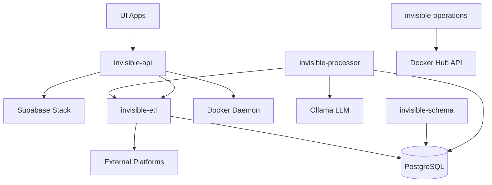

# Invisible Platform Architecture

## Overview

The Invisible platform consists of multiple microservices deployed on Kubernetes using ArgoCD for GitOps.

## Services

### Core Infrastructure (Supabase)
- **PostgreSQL**: Main database
- **Kong**: API Gateway (ports 8000/8443)
- **GoTrue (Auth)**: Authentication service
- **PostgREST**: RESTful API for PostgreSQL
- **Realtime**: WebSocket server for real-time subscriptions
- **Storage**: S3-compatible object storage
- **Studio**: Web-based database management UI
- **Analytics**: Logflare for logs and analytics
- **Functions**: Edge Functions runtime
- **Vector**: Log aggregation
- **Supavisor**: Connection pooler

### Application Services
- **invisible-api** (4300): Main API handling authentication, Docker management
- **invisible-etl** (4001): Platform data synchronization (Gmail, Slack, Telegram, WhatsApp)
- **invisible-processor**: AI-powered message processing using LLMs
- **invisible-schema** (8000): SQLMesh for database schema management
- **invisible-operations** (8081): License validation and JWT generation

### UI Applications
- **ui-hub**: Administrative dashboard for platform management
- **ui-chat**: Chat interface for viewing aggregated messages

## Service Dependencies

## Deployment Strategy

1. **Namespace**: All services deployed in `invisible` namespace
2. **Configuration**: 
   - ConfigMaps for non-sensitive configuration
   - Secrets for passwords, tokens, and keys
   - Kustomize for environment-specific overlays
3. **Storage**: 
   - PersistentVolumeClaims for stateful services
   - Local storage for development
   - Cloud storage for production
4. **Networking**:
   - ClusterIP services for internal communication
   - Ingress for external access
   - Service mesh optional for advanced scenarios

## Environment Configuration

### Development
- Single replicas
- Local storage
- Self-signed certificates
- Resource limits relaxed

### Staging
- Similar to production but smaller
- Separate database
- Testing integrations

### Production
- High availability where possible
- Cloud storage backends
- Proper SSL certificates
- Resource limits enforced
- Monitoring and alerting